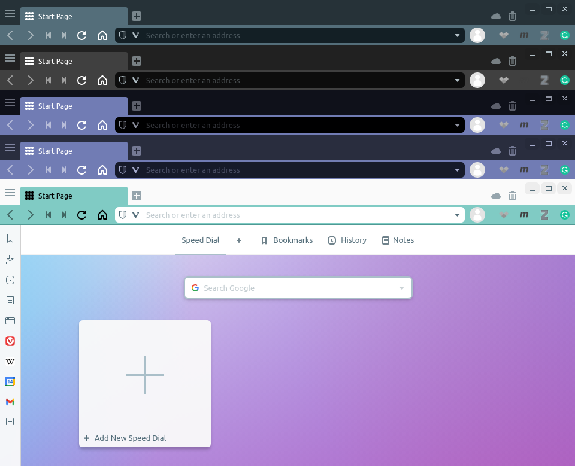
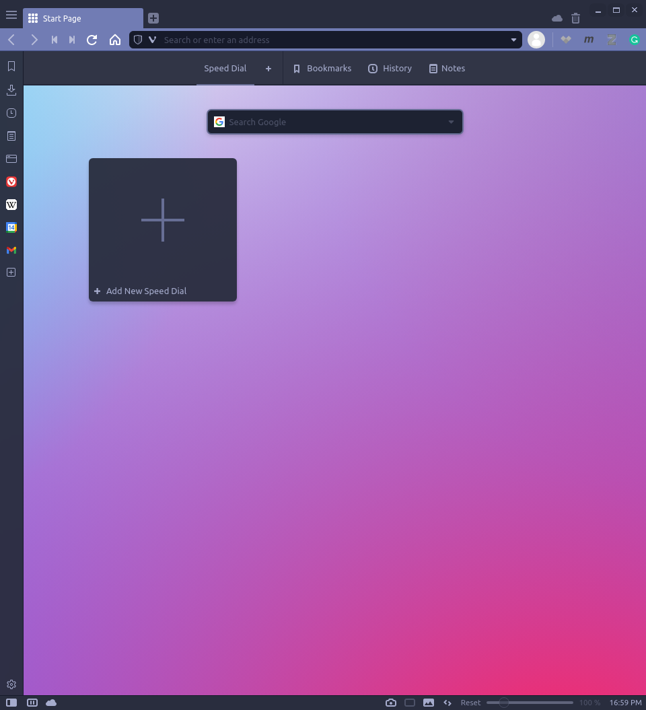

# Vivaldi Material Theme

The minimal dark theme inspired by [Material Theme][material-web] for [Vivaldi][vivaldi] web browser.



> [Material][material], [Material Darker][material-darker], [Material Deep Ocean][material-deepocean], [Material Palenight][material-palenight], [Material Lighter][material-lighter]

## Install

### Manual

1. Open Vivaldi's Settings
   1. **Linux**: Menu > Tools > Settings (`Ctrl+F12`)
   2. **Windows**: Tools Menu > Settings (`Ctrl+F12`)
   3. **MacOS**: Menu > Preferences (`Command+,`)
2. Select `Themes` in the panel
3. Click the `+` and enter a name (e.g., Material)
4. Copy the theme's `.json` values to the Vivaldi theme

For example, if I want the traditional Material theme, use the colors from [material.json](material.json)

- Background: `#263238`
- Foreground: `#b0bec5`
- Highlight: `#546e7a`
- Accent: `#546e7a`

See [Colors](#colors) for recommended Vivaldi-Material color/setting combinations.

### Automatic

*This feature is not currently implemented.*

*If you have ideas how to automatically generate/update/sync Vivaldi themes, please see [Contributing](#contributing). I would love to have this feature.*

## Colors

The material theme colors were obtained from [material-theme.com](material-theme-colors).

My recommendation is to use the following values for the Vivaldi settings
| Vivaldi Setting | Recommended | Colorful   |
|-----------------|-------------|------------|
| Background      | background  | background |
| Foreground      | foreground  | foreground |
| Highlight       | comment     | comment    |
| Accent          | selection   | accent     |

> Note: `highlight` and `accent` material colors can be difficult to see with their corresponding Vivaldi settings.

If you like a **pop of color** in your theme, I would substitute the `Accent` Vivaldi setting for the Material `accent` color. Below is an example with the default Material Theme.

| Theme              | Recommended                        | Colorful                                    |
|--------------------|------------------------------------|---------------------------------------------|
| Material           | ![material-png][material-png]      | ![material-accent-png][material-accent-png] |
| Material Darker    |     |       |
| Material DeepOcean |  |    |
| Material Lighter   |    |      |
| Material Palenight |  |    |

<!-- ## Customize

You may generate a new theme `.json` from an existing theme color palette.

```python theme.py --create material --accent selection``` -->

<!-- links -->
[vivaldi]: https://vivaldi.com
[material-web]: https://material-theme.site
[material-theme-colors]: https://material-theme.com/docs/reference/color-palette/
[material-png]: assets/material.png
[material-accent-png]: assets/material-accent.png
[material]: assets/material.png
[material-darker]: assets/material-darker.png
[material-deepocean]: assets/material-deepocean.png
[material-lighter]: assets/material-lighter.png
[material-palenight]: assets/material-palenight.png
